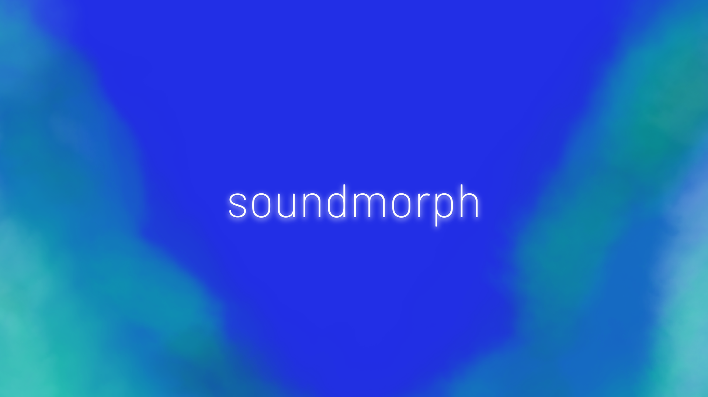

<!-- HEADER -->
</img>
<h1 align="center">SOUNDMORPH 🎛</h1>
<h3 align="center">An effects and sound processing vst plugin.</h3>

  
  
  

<h3 align="center">Languages and Tools 🛠</h3>

  

<!-- TABLE OF CONTENTS -->

  
Table of Contents

  <ol>
    <li><a href="#about-the-project">About The Project</a></li>
    <li><a href="#usage">Usage</a></li>
    <li><a href="#license">License</a></li>
    <li><a href="#contact">Contact</a></li>
  </ol>

---

<!-- ABOUT THE PROJECT -->
<h2 id="about-the-project">About The Project</h2>

  "SoundMorph" it is a small student project in growth. Their approach is to replicate the most common effects used.

<ul>
  <li>Goal: Develop a cool VST Plugin for any DAW</li>
  <li>Technologies: C#, JUCE Framework & Visual Studio.</li>
  <li>Problem: Study patterns, algorithms and development of virtual instruments</li>
</ul>

<!-- USAGE -->
<h2 id="usage">Usage</h2>

This code is available for educational purposes. Use it to learn, practice, or reference specific techniques or concepts.

  <strong>Note:</strong> Redistribution or use in production systems without proper attribution is discouraged.

<!-- LICENSE -->
<h2 id="license">License</h2>

This project is licensed under the MIT License. See the <a href="https://github.com/dnbsammie/SoundMorph/readme/LICENSE">LICENSE</a> file for details.

  <strong>Permission is granted to use this code for learning purposes, provided that proper credit is given.</strong>

<!-- CONTACT -->
<h2 id="contact">Contact</h2>

  <strong>Author:</strong> Samuel Rivera 
  <strong>GitHub:</strong> <a href="https://github.com/dnbsammie">https://github.com/dnbsammie</a>

